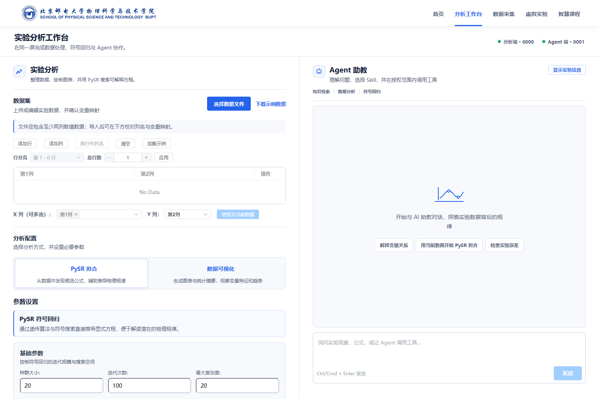
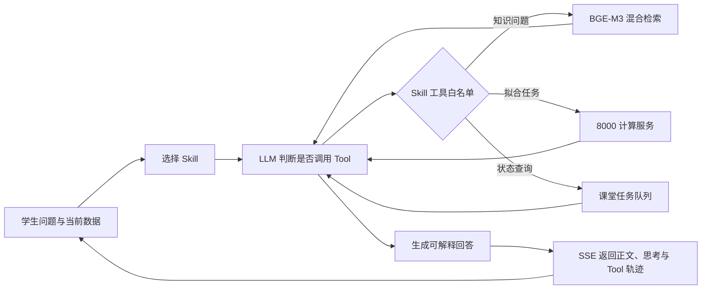
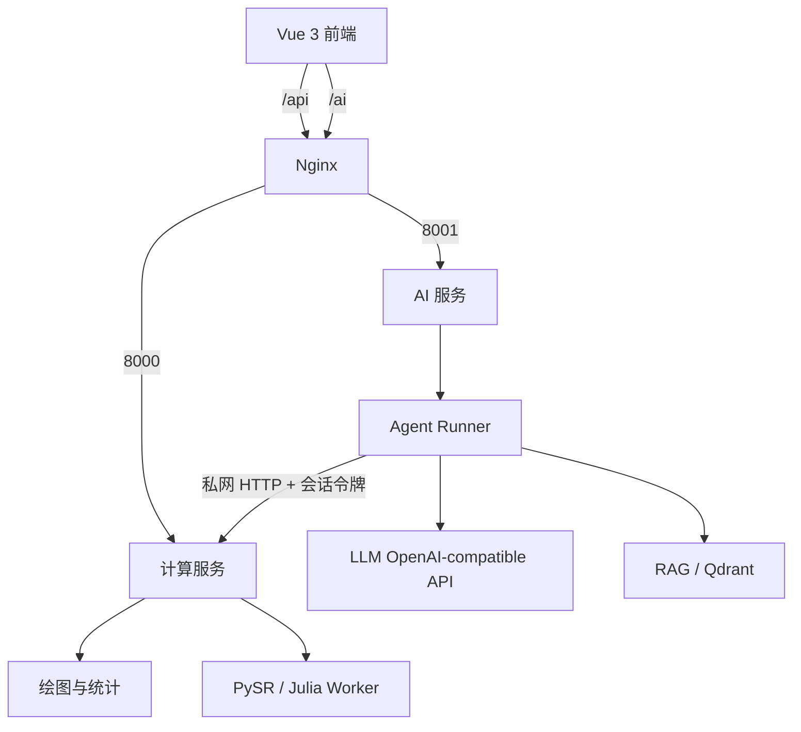

# GuideLab · 物理实验 Agent 工作台

GuideLab 是面向高校物理实验课堂的智能分析平台。学生可以在同一工作台中整理实验数据、生成统计图表、运行 PySR 符号回归，并让 Agent 检索课程资料、解释实验现象或直接调用计算工具。

项目采用 **Web + 计算服务 + AI 服务** 的拆分架构：PySR 与 Julia 只部署在计算端，AI 问答与 RAG 可以独立运行和扩容。



## Agent 如何工作

GuideLab 的 Agent 不是在提示词里“假装使用工具”，而是一个带权限边界的服务端执行循环：



### Skill、Tool 与 Runner

- **Skill**：定义专家工作模式、任务说明和允许调用的 Tool 白名单。
- **Tool**：使用 JSON Schema 描述参数，并绑定一个受控的服务端 Python 函数。
- **Runner**：执行“模型请求 Tool → 校验权限与参数 → 服务端执行 → 结果回传模型 → 生成最终回答”的多轮循环。
- **前端追踪**：SSE 会返回结构化 Tool 轨迹；如果 Agent 创建了 PySR 任务，前端会按当前课堂会话持续轮询并只展示该学生自己的任务。

内置 Skill：

| Skill | 作用 |
| --- | --- |
| `physics_experiment` | 解释实验现象、数据趋势、误差来源与拟合结果 |
| `symbolic_regression` | 选择 PySR 参数、跟踪任务、比较候选方程与物理可解释性 |

内置 Tool：

| Tool | 作用 |
| --- | --- |
| `search_physics_knowledge` | 检索本地物理知识库并返回来源片段 |
| `start_symbolic_regression` | 使用当前会话绑定的数据提交 PySR 任务 |
| `get_analysis_task_status` | 查询队列位置、进度、耗时和候选方程 |
| `cancel_analysis_task` | 取消等待中或运行中的任务 |
| `get_analysis_service_status` | 查询计算端槽位、队列和利用率 |

能力发现接口：

```http
GET /agent/capabilities
```

扩展方法和安全约束见 [Agent Skill 与 Tool 指南](docs/AGENT_SKILLS_AND_TOOLS.md)。

## 核心能力

- **双工作区前端**：实验分析与 Agent 问答在桌面端 1:1 分屏，移动端按双标签切换。
- **数据分析**：散点图、折线图、柱状图、箱线图、热力图、趋势线与统计摘要。
- **PySR 符号回归**：并发任务队列、进度查询、取消、候选方程和拟合图。
- **混合 RAG**：BGE-M3 同时生成 dense/sparse 向量，Qdrant 使用 RRF 融合，再由 BGE reranker 重排。
- **数据直连 Agent**：分析页中的完整数据保留在服务端 Tool 上下文，模型只接收受限预览。
- **课堂多用户隔离**：HttpOnly 签名会话、按学生限流、任务所有权检查和会话级队列限制。
- **双后端独立部署**：AI 服务不导入 PySR，也不需要安装 Julia。

## 系统架构



| 模块 | 默认端口 | 职责 |
| --- | ---: | --- |
| Vue Web | 5173 | 数据编辑、分析配置、结果展示、Agent 对话与任务追踪 |
| Compute API | 8000 | 绘图、统计、PySR 调度和 Julia Worker |
| AI API | 8001 | 问答、Agent、Skill/Tool、RAG 与课堂限流 |

## 快速开始

### 环境要求

- Node.js 18+
- Python 3.11 或 3.12
- Julia 1.10+（仅计算服务需要）
- 生产环境建议使用 Nginx 统一提供 HTTPS 与同源反向代理

### 1. 获取代码与配置

```bash
git clone https://github.com/Freeee0818/RuixiLab.git
cd RuixiLab
cp .env.example .env
```

至少配置一个 OpenAI-compatible 模型服务，并让两个后端使用相同的课堂密钥：

```env
AI_API_BASE_URL=https://dashscope.aliyuncs.com/compatible-mode/v1
AI_API_KEY=your-key
AI_API_MODEL=qwen3-max

CLASSROOM_SESSION_SECRET=use-openssl-rand-hex-32
COMPUTE_SERVICE_URL=http://127.0.0.1:8000
RAG_ENABLE_TOOL=false
```

### 2. 启动计算服务

建议为计算端创建独立虚拟环境：

```bash
python -m venv .venv-compute
source .venv-compute/bin/activate
python -m pip install -r analysis_module/requirements.txt
python -m analysis_module.main --port 8000
```

Windows PowerShell 激活命令：

```powershell
.\.venv-compute\Scripts\Activate.ps1
```

### 3. 启动 AI 服务

AI 环境无需安装 Julia 或 PySR：

```bash
python -m venv .venv-ai
source .venv-ai/bin/activate
python -m pip install -r ai_module/requirements.txt
python -m ai_module.main --port 8001
```

### 4. 启动前端

```bash
npm install
npm run dev
```

开发环境默认访问 `http://localhost:8000` 与 `http://localhost:8001`。生产环境通过下面两个构建变量指向 Nginx 路由：

```env
VITE_COMPUTE_API_URL=/api
VITE_AI_API_URL=/ai
```

## 启用混合 RAG

1. 将 PDF、DOCX、PPTX、TXT 等资料放入 `knowledge_base/raw_docs/`。
2. 保持 `RAG_ENABLE_TOOL=false`，停止 AI 服务后执行入库。
3. 比较 dense、sparse、hybrid 和 hybrid-rerank 的效果。
4. 评测通过后设置 `RAG_ENABLE_TOOL=true` 并重启 AI 服务。

```bash
python scripts/ingest_knowledge.py
python scripts/test_rag.py --compare "单摆周期公式是什么"
python scripts/evaluate_rag.py --output rag-report.json
```

阿里云模型下载、Transformers 版本约束与入库流程见 [RAG 上线指南](docs/ALIYUN_RAG_DEPLOYMENT.md)。

## 课堂并发与安全边界

- 浏览器只持有后端签发的 HttpOnly 签名会话，不接触模型 API Key。
- AI 服务通过私网 HTTP 调用计算服务，不导入 Julia/PySR 代码。
- Skill 只能使用其白名单内的 Tool，模型不能直接执行 Python 或 Shell。
- Tool 参数先经过 Schema 校验，返回内容有长度上限。
- 任务查询、取消与图表接口校验会话所有权，避免学生之间串任务。
- 默认每个学生同时运行 1 个 PySR 任务、排队 2 个任务；全局并发可按服务器规格调整。
- 达到 Tool 最大轮数后，Runner 会停止继续调用并要求模型基于已有结果作答。

## 项目结构

```text
GuideLab/
├── src/                    # Vue 3 前端
├── ai_module/              # AI API、Agent Runner、Skill 与 Tool
├── rag_module/             # 文档切分、入库、混合检索与重排
├── analysis_module/        # 计算服务入口与绘图接口
├── pysr_module/            # PySR 调度器、Worker 与任务接口
├── service_common/         # 会话、CORS、健康检查等共享边界
├── config/                 # pydantic-settings 配置
├── knowledge_base/         # 原始资料、评测集和本地索引
├── deploy/                 # AI/Compute/Web/Nginx 部署说明
├── scripts/                # 入库、评测、回归、压测与发布脚本
├── tests/                  # Agent、会话、调度与 RAG 测试
└── docs/                   # 架构、部署和扩展文档
```

## 验证与发布

```bash
# 前端构建
npm run build

# 前端端到端测试
npm run test:e2e

# Python 回归测试
python -m unittest discover -s tests -p "test_*.py" -v

# 生成 Compute、AI、Knowledge 与 Web 上传包
python scripts/build_release.py
```

常用运行检查：

```bash
curl http://127.0.0.1:8000/health
curl http://127.0.0.1:8000/service-status
curl http://127.0.0.1:8001/health
curl http://127.0.0.1:8001/agent/capabilities
```

## 部署文档

- [双后端拆分部署](docs/BACKEND_SPLIT.md)
- [阿里云 RAG 部署](docs/ALIYUN_RAG_DEPLOYMENT.md)
- [阿里云后端检查清单](docs/ALIYUN_BACKEND_DEPLOY_CHECKLIST.md)
- [Agent Skill 与 Tool 扩展](docs/AGENT_SKILLS_AND_TOOLS.md)
- [部署包与目录说明](deploy/README.md)
- [课堂多用户安全配置](deploy/nginx/CLASSROOM_SECURITY.md)

## 配置提醒

- 不要提交 `.env`、模型 API Key、课堂密钥、向量库或学生数据。
- 生产环境应只公开 80/443；8000/8001 由 Nginx 在本机或私网反向代理。
- 本地 Qdrant 文件模式只能由一个 AI 进程持有；入库时先停止 AI 服务。
- PySR 的并发度同时受 CPU 核数、Julia 线程数和单任务内存影响，调整后应先做压力测试。
